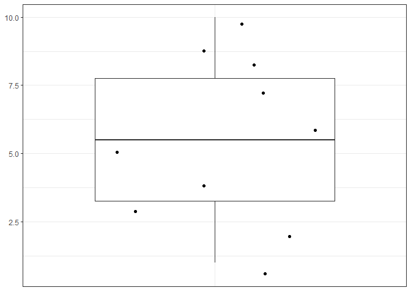
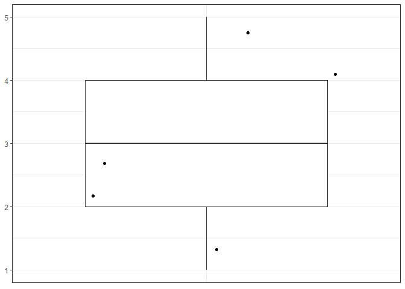

<!-- README.md is generated from README.Rmd. Please edit that file -->

# summaryandboxplot

<!-- badges: start -->


<!-- badges: end -->

The goal of summaryandboxplot is to summarize a numeric vector with
summary stats (number of elements, number of unique elements, min, 1st
quartile, median, mean, 3rd quartile, max, and number of NAs) and
provide a box-and-jitter plot to produce a visual respresentation of the
numeric vector (NOTE: the jitters in the box-and-jitter plot are
stochastic and can appear in different positions between runs).

## Installation

You can install the development version of summaryandboxplot like so:

``` r
# install.packages("devtools")
devtools::install_github("stat545ubc-2022/assignment-b1-and-b2-jowong4", ref = "0.1.0")
```

## Example

This is a basic example which shows you how to use summary\_and\_boxplot
to summarize a numeric vector:

``` r
library(summaryandboxplot)

summary_and_boxplot(1:10)
#> There are 0 NA entries in your numeric vector input.
#> There are 10 entries in your numeric vector input.
#> There are 10 unique entries in your numeric vector input.
#> Min: 1
#> 1st quartile: 3.25
#> Median: 5.5
#> Mean: 5.5
#> 3rd quartile: 7.75
#> Max: 10
```



    #> [1] 10.00 10.00  1.00  3.25  5.50  5.50  7.75 10.00  0.00

    summary_and_boxplot(c(1, 2, 3, 4, 5))
    #> There are 0 NA entries in your numeric vector input.
    #> There are 5 entries in your numeric vector input.
    #> There are 5 unique entries in your numeric vector input.
    #> Min: 1
    #> 1st quartile: 2
    #> Median: 3
    #> Mean: 3
    #> 3rd quartile: 4
    #> Max: 5



    #> [1] 5 5 1 2 3 3 4 5 0
