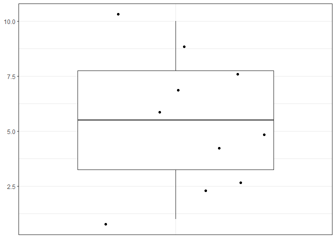
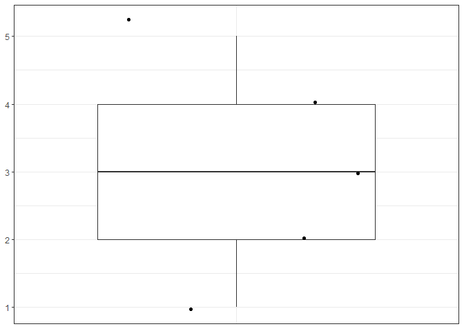

<!-- README.md is generated from README.Rmd. Please edit that file -->

# summaryandboxplot

<!-- badges: start -->
<!-- badges: end -->

The goal of summaryandboxplot is to summarize a numeric vector with
summary stats and provide a boxplot to produce a visual respresentation
of the numeric vector.

## Installation

You can install the development version of summaryandboxplot like so:

``` r
# FILL THIS IN! HOW CAN PEOPLE INSTALL YOUR DEV PACKAGE?
```

## Example

This is a basic example which shows you how to solve a common problem:

``` r
library(summaryandboxplot)
summary_and_boxplot(1:10)
#> There are 0 NA entries in your numeric vector input.
#> There are 10 entries in your numeric vector input.
#> There are 10 unique entries in your numeric vector input.
#> Min: 1
#> 1st quartile: 3.25
#> Median: 5.5
#> Mean: 5.5
#> 3rd quartile: 7.75
#> Max: 10
```



    #> [1] 10.00 10.00  1.00  3.25  5.50  5.50  7.75 10.00  0.00
    summary_and_boxplot(c(1, 2, 3, 4, 5))
    #> There are 0 NA entries in your numeric vector input.
    #> There are 5 entries in your numeric vector input.
    #> There are 5 unique entries in your numeric vector input.
    #> Min: 1
    #> 1st quartile: 2
    #> Median: 3
    #> Mean: 3
    #> 3rd quartile: 4
    #> Max: 5



    #> [1] 5 5 1 2 3 3 4 5 0
