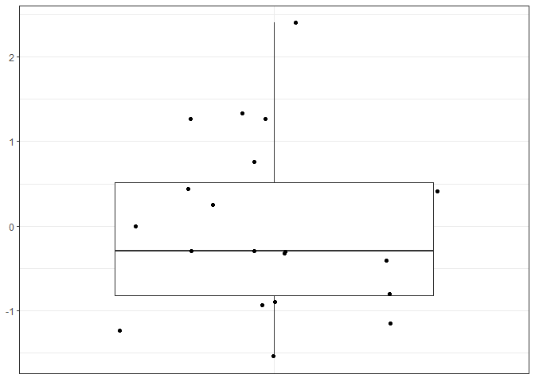
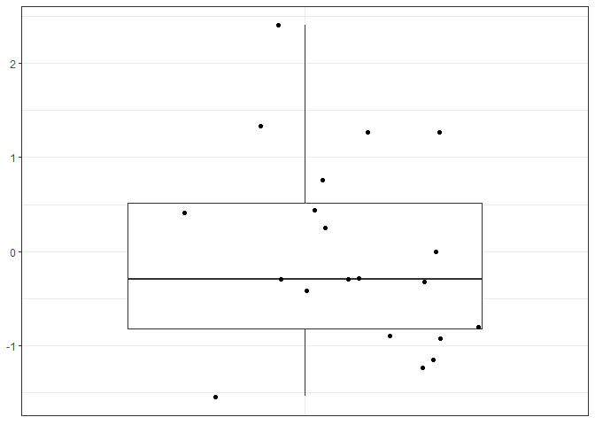
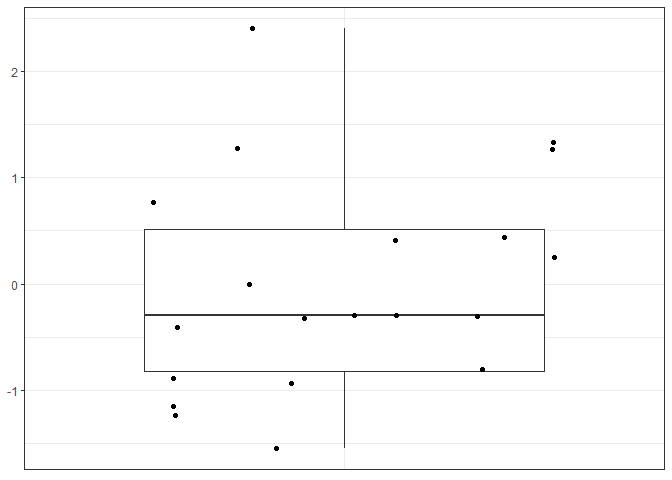
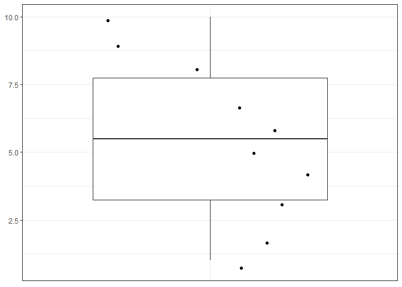
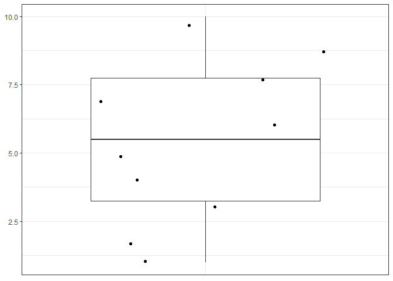
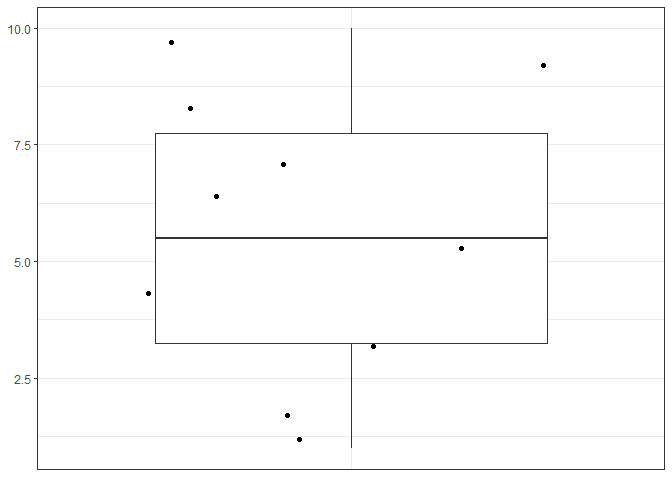

Assignment B-1
================
Johnathan Wong
November 3, 2022

Loading the `tidyverse` package to use for my function:

``` r
library(tidyverse)
```

## Function Definition

``` r
#' summary_and_boxplot: Summarize numeric vector and output boxplot
#'
#' Summarize a numeric vector input and output a numeric vector containing number of elements, number of unique elements, min, 
#' 1st quartile, median, mean, 3rd quartile, max, and number of NAs.
#' Also outputs a boxplot with NA entries removed.
#'
#'
#' @param num_vec a numeric vector used to calculate summary statistics. num_vec is short for numeric_vector.
#' @param na.rm logical, remove NA entries when generating summary statistics if TRUE. (NOTE: boxplot will not use NA entries regardless of this parameter). na.rm is what many other functions call the parameter to remove NA, so I just followed the convention.
#'
#' @return a numeric vector containing number of elements, number of unique elements, min, 1st quartile, median, mean, 3rd quartile, max, and number of NAs (in this order).
#'
summary_and_boxplot <- function(num_vec, na.rm = TRUE) {
  if(!is.numeric(num_vec)) {
    stop('This function only works for a numeric vector input!\n',
         'You have provided an object of class: ', class(num_vec)[1], '.\n')
  } else {
    if(length(num_vec) == 0) {
      stop('Your numeric vector has no elements!\n',
           'This function only works for a numeric vector input with a number of elements greater than 0!\n')
    } 
  }
  
  num_NA <- sum(is.na(num_vec))
  
  message('There are ',
          num_NA,
          ' NA entries in your numeric vector input.')
  
  if (na.rm & num_NA != 0) {
    message('Removing ',
            sum(is.na(num_vec)),
            ' NA entries from your numeric vector input.')
    num_vec <- num_vec[!is.na(num_vec)]
    if(length(num_vec) == 0) {
      stop('Your numeric vector has no elements after removing NA entries!\n',
           'This function only works for a numeric vector input with a number of non-NA elements greater than 0!\n')
    } 
  }
  
  num_vec_len <- length(num_vec)
  
  if(num_vec_len == num_NA & !na.rm) {
      stop('Your numeric vector only contains NA entries!\n',
           'This function only works for a numeric vector input with a number of non-NA elements greater than 0!\n')
  }
  
  uniq_num_vec_len <- length(unique(num_vec))
  
  message('There are ',
          num_vec_len,
          ' entries in your numeric vector input.')
  message('There are ',
          uniq_num_vec_len,
          ' unique entries in your numeric vector input.')

  num_vector_summary <- as.vector(unclass(summary(num_vec)))
  num_vector_summary[7] <- num_NA # set number of NAs to before NAs were removed if na.rm is TRUE

  message('Min: ', num_vector_summary[1])
  message('1st quartile: ', num_vector_summary[2])
  message('Median: ', num_vector_summary[3])
  message('Mean: ', num_vector_summary[4])
  message('3rd quartile: ', num_vector_summary[5])
  message('Max: ', num_vector_summary[6])
  
  #plotting boxplot
  df_num_vec <- as_tibble(num_vec)
  sum_boxplot <- ggplot(df_num_vec,
                        aes(x = factor(0), num_vec)) +
    geom_boxplot(na.rm = TRUE) + # supress warning message about removing NA entries
    geom_jitter(na.rm = TRUE) + # supress warning message about removing NA entries
    theme_bw() + 
    theme(axis.title.y = element_blank(),
          axis.title.x = element_blank(),
          axis.text.x = element_blank(),
          axis.ticks.x = element_blank())
  
  print(sum_boxplot)

  return(c(num_vec_len,
           uniq_num_vec_len,
           num_vector_summary))
}
```

## Examples

``` r
set.seed(0) # ensure same example is generated
example <- rnorm(20) # create example numeric input vector
```

Demonstrating `summary_and_boxplot` usage. Summarizing a regular numeric
vector with no NAs.

``` r
example
```

    ##  [1]  1.262954285 -0.326233361  1.329799263  1.272429321  0.414641434
    ##  [6] -1.539950042 -0.928567035 -0.294720447 -0.005767173  2.404653389
    ## [11]  0.763593461 -0.799009249 -1.147657009 -0.289461574 -0.299215118
    ## [16] -0.411510833  0.252223448 -0.891921127  0.435683299 -1.237538422

``` r
summary_and_boxplot(example)
```

    ## There are 0 NA entries in your numeric vector input.

    ## There are 20 entries in your numeric vector input.

    ## There are 20 unique entries in your numeric vector input.

    ## Min: -1.53995004190371

    ## 1st quartile: -0.822237218563168

    ## Median: -0.292091010239392

    ## Mean: -0.00177867437412394

    ## 3rd quartile: 0.517660839801904

    ## Max: 2.40465338885795

<!-- -->

    ## [1] 20.000000000 20.000000000 -1.539950042 -0.822237219 -0.292091010
    ## [6] -0.001778674  0.517660840  2.404653389  0.000000000

Summarizing a numeric vector with NAs using default behaviour.

``` r
example_with_NA <- c(example, rep(NA, 20))
summary_and_boxplot(example_with_NA)
```

    ## There are 20 NA entries in your numeric vector input.

    ## Removing 20 NA entries from your numeric vector input.

    ## There are 20 entries in your numeric vector input.

    ## There are 20 unique entries in your numeric vector input.

    ## Min: -1.53995004190371

    ## 1st quartile: -0.822237218563168

    ## Median: -0.292091010239392

    ## Mean: -0.00177867437412394

    ## 3rd quartile: 0.517660839801904

    ## Max: 2.40465338885795

<!-- -->

    ## [1] 20.000000000 20.000000000 -1.539950042 -0.822237219 -0.292091010
    ## [6] -0.001778674  0.517660840  2.404653389 20.000000000

Summarizing a numeric vector with NAs using `na.rm == FALSE`.

``` r
summary_and_boxplot(example_with_NA, FALSE)
```

    ## There are 20 NA entries in your numeric vector input.

    ## There are 40 entries in your numeric vector input.

    ## There are 21 unique entries in your numeric vector input.

    ## Min: -1.53995004190371

    ## 1st quartile: -0.822237218563168

    ## Median: -0.292091010239392

    ## Mean: -0.00177867437412394

    ## 3rd quartile: 0.517660839801904

    ## Max: 2.40465338885795

<!-- -->

    ## [1] 40.000000000 21.000000000 -1.539950042 -0.822237219 -0.292091010
    ## [6] -0.001778674  0.517660840  2.404653389 20.000000000

Summarizing an invalid input.

``` r
summary_and_boxplot(c('a', 'b'))
```

    ## Error in summary_and_boxplot(c("a", "b")): This function only works for a numeric vector input!
    ## You have provided an object of class: character.

## Tests

Loading the `testthat` package to make tests for my function.

``` r
library(testthat)
```

``` r
test_that("Testing summarize and boxplot function", {
  # setting up different tests
  num_vec <- c(1, 2, 3, 4, 5, 6, 7, 8, 9, 10)
  num_vec_with_NA <- c(num_vec, rep(NA, 10))
  char_vec <- c('a')
  empty_vec <- num_vec[num_vec < 0]
  NA_vec <- c(1)
  NA_vec[1] = NA # numeric vector with NA entries. c(NA) is not a numeric vector.
  
  # test valid cases
  expect_equal(summary_and_boxplot(num_vec),
               c(10.00, 10.00,  1.00,  3.25,  5.50,  5.50,  7.75,  10.0, 0.00))
  expect_equal(summary_and_boxplot(num_vec_with_NA),
               c(10.00, 10.00,  1.00,  3.25,  5.50,  5.50,  7.75,  10.0, 10.00))
  expect_equal(summary_and_boxplot(num_vec_with_NA, FALSE),
               c(20.00, 11.00,  1.00,  3.25,  5.50,  5.50,  7.75, 10.00, 10.00))
  

  # testing error cases
  expect_error(summary_and_boxplot(char_vec),
               paste0('This function only works for a numeric vector input!\n',
                      'You have provided an object of class: ',
                      class(char_vec)[1], '.\n'),
               fixed = TRUE)
  expect_error(summary_and_boxplot(empty_vec),
               paste0('Your numeric vector has no elements!\n',
                      'This function only works for a numeric vector input with a number of elements greater than 0!\n'),
               fixed = TRUE)
  expect_error(summary_and_boxplot(NA_vec),
               paste0('Your numeric vector has no elements after removing NA entries!\n',
                   'This function only works for a numeric vector input with a number of non-NA elements greater than 0!\n'),
               fixed = TRUE)
  expect_error(summary_and_boxplot(NA_vec, FALSE),
               paste0('Your numeric vector only contains NA entries!\n',
                   'This function only works for a numeric vector input with a number of non-NA elements greater than 0!\n'),
               fixed = TRUE)
})
```

<!-- --><!-- --><!-- -->

    ## Test passed
